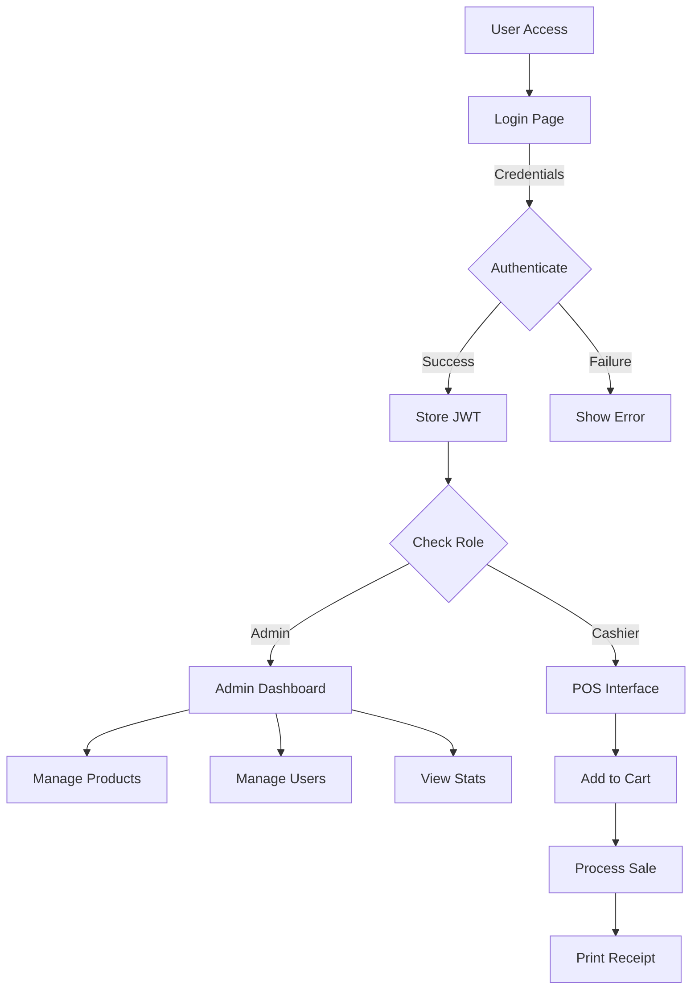
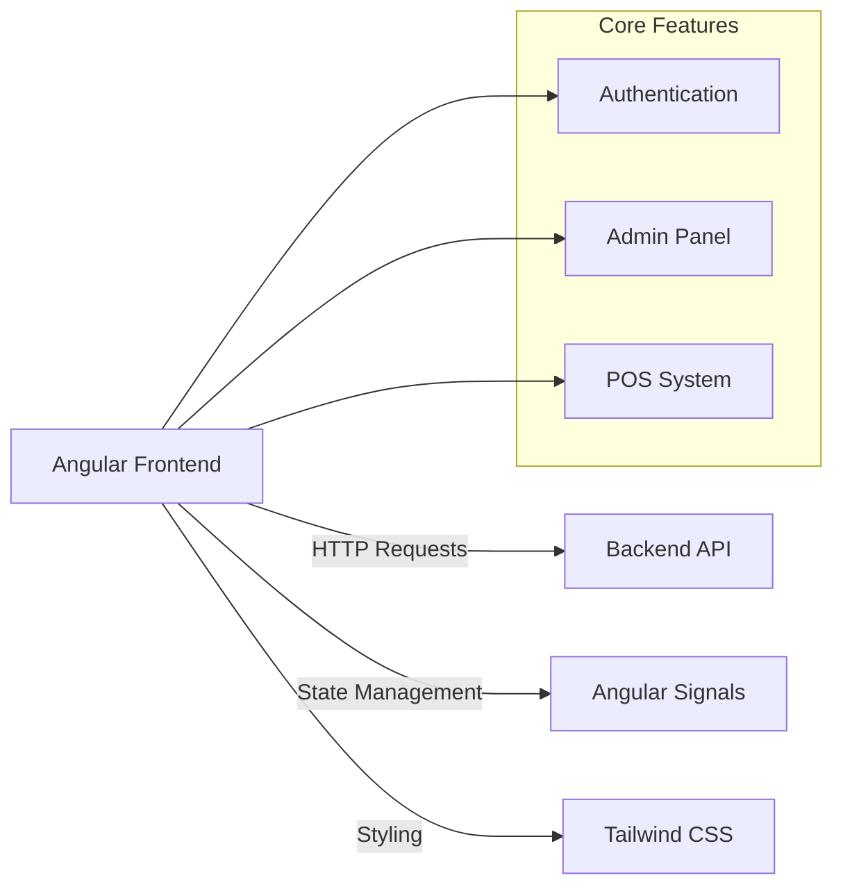

# POS System Frontend

**What is it?**
A modern Point of Sale (POS) system frontend built with Angular 19. It provides a comprehensive solution for managing sales, inventory, products, and users, featuring a secure authentication system, a responsive admin dashboard, and an intuitive cashier interface.

## 📋 Features

### 🔐 Authentication & Security

- **Secure Login** - JWT-based authentication with role-based access.
- **Password Management** - Complete flow for forgot, change, and reset passwords.
- **Protected Routes** - Secure guards for admin and POS sections.

### 👨‍💼 Admin Panel

- **Dashboard** - Visual analytics of sales and KPIs.
- **Resource Management** - Full CRUD for Products, Inventory, and Users.
- **Store Configuration** - Customizable store settings.

### 🛒 POS Interface

- **Fast Checkout** - Streamlined product selection and cart management.
- **Real-time Calculations** - Automatic tax and total updates.
- **Receipts** - Print-ready sales receipts.

## ⚙️ Installation & Build

### Prerequisites

- Node.js >= 18.x
- npm or pnpm
- Angular CLI (`npm install -g @angular/cli`)

### Installation Steps

1. **Clone the repository**

   ```bash
   git clone https://github.com/CarlosPerez1999/pos-system-frontend
   cd pos-system-frontend
   ```

2. **Install dependencies**

   ```bash
   npm install
   ```

3. **Environment Setup**
   Configure your API URL in `src/environments/environment.development.ts`:

   ```typescript
   export const environment = {
     production: false,
     API_URL: "http://localhost:3000/api",
   };
   ```

4. **Run Development Server**
   ```bash
   ng serve
   ```
   Access the app at `http://localhost:4200`.

### Build for Production

To create a production build:

```bash
ng build --configuration production
```

The output files will be located in `dist/pos_system_ui/browser/`.

## 🏗️ Project Structure

```
src/
├── app/
│   ├── auth/                     # Authentication pages & services
│   ├── core/                     # Singleton services, guards, interceptors
│   ├── features/                 # Feature modules
│   │   ├── admin/                # Admin dashboard & management
│   │   ├── pos/                  # Point of Sale interface
│   │   ├── products/             # Product management
│   │   ├── inventory/            # Stock management
│   │   ├── users/                # User management
│   │   └── sales/                # Sales history
│   ├── shared/                   # Reusable components & pipes
│   └── app.routes.ts             # Main routing configuration
└── environments/                 # Environment variables
```

## � System Diagrams

### Application Flow



### Architecture Overview


